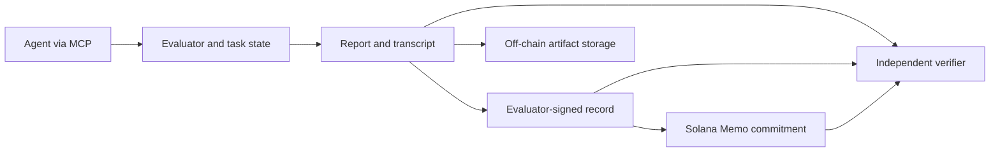

# Epistemics

Public repository: [palendrapp/epistemics](https://github.com/palendrapp/epistemics). The initial commits reconstruct the project's development stages; [history and dating](docs/development-history.md) explains their provenance.

Building infrastructure for **measuring and coordinating epistemic reliability**, starting with an epistemic passport for agents: a standard evaluation that produces an interpretable behavioral profile, attached to an agent's identity and evaluated configuration through verifiable records on Solana. The same underlying evaluation supports private human participation.

The primary consumer is an agent or orchestrator deciding whom to hire and how to delegate. A machine-readable passport supplies behavioral evidence before a bounded service purchase; people can inspect the same profile. The [agent-economy design](docs/agent-economy.md) connects Solana Agent Registry identity, task policy and x402 payments, with paid evaluations as the initial revenue hypothesis. The profile describes observed behavior under declared conditions; reported probabilities are not direct access to internal beliefs.

The [product brief](docs/epistemic-passport.md) defines the experience and dimensions. The repository provides a [shared core evaluation for humans and agents](docs/live-core.md), readable/JSON profiles, [offline passport attestations](docs/passport-attestation.md), a [local machine consumer](docs/machine-consumer.md) and legacy signed-report components. Pinned devnet identity reads, signed lifecycle status, private artifact retrieval and task policies are implemented. Public hosting and paid endpoints remain roadmap work.

The [current delivery strategy](docs/decision-value-pilot.md) targets one portable behavioral claim that improves a concrete buyer decision: whether to require independent verification before accepting a research conclusion. The [sixteen-session repeatability and research-packet comparison](docs/source-panel-results-2026-09-26.md) is complete. It supports reporting scoped repeatability and presentation results, while configuration-specific fits added no transfer benefit. The [clarified source interface](docs/source-delivery-v2.md) and [scoped source passports](docs/source-learning-passport.md) are implemented; the [eight-context assigned-verification comparison](docs/verification-stage-a-results-2026-09-26.md) is complete. Blanket purchasing improved Brier but reduced net payoff in every matched contrast. The next increment is a simple cost-aware verification policy tested with prices separated from company priors; passport-guided allocation remains deferred. General support benefit is tested separately from personalization; a bounded design-partner assessment can test demand before automated payment infrastructure is needed.

The original [company-investigation development module](docs/company-investigation.md) adds source-versus-business attribution probes, a paid research choice and a transcription correction. It includes a joint observer, competing models, synthetic discrimination/recovery checks and a bound MCP collector. Its [first six-case fresh-agent run](docs/investigation-acceptance-2026-09-20.md) completed in about four minutes: decisions matched reported probabilities, but candidate models fit poorly overall and all sampled transcription offsets were zero. Those findings motivated the separate revision below; the original results do not establish validated passport traits.

The [0.2 diagnostic revision](docs/company-investigation-v2.md) supplies **12 cases / 48 checkpoints**, guaranteed correction coverage, matched research prices, prospective query forecasts and separate source-feedback/report-adjustment parameters. Its [fresh-agent acceptance run](docs/investigation2-acceptance-2026-09-21.md) completed all 198 probability reports in 8 minutes 50 seconds: decisions and prospective forecasts were coherent, research purchases followed the matched prices, and all four nonzero corrections prompted revisions in the expected direction. The conditional model still fits poorly; an exploratory comparison implicates how it treats initial reports as persistent priors. Humans can use the same private browser flow; actual human acceptance remains pending. The follow-up repeatability and conditional-prediction results are reported for 0.3 below. No validated passport trait is issued.

The [0.3 revision](docs/company-investigation-v3.md) clarifies the source probe and review status, and compares working-prior, hard-report and noisy-report initializations. Both declared synthetic recovery runs pass. [Investigation passports](docs/investigation-passport.md) now carry exact-byte evidence, behavioral summaries, coverage counts and separate model diagnostics through HTML/JSON, offline signatures and the machine consumer. The [0.3 prospective pilot](docs/investigation3-results-2026-09-23.md) completed 36 fresh-context episodes: repeat reports differed by 3.72 points RMS, while fitted models showed no clear average-error gain over fixed observers on new cases. Human completion remains pending; source evidence and model explanations remain separate.

The new [auxiliary diagnostic](docs/auxiliary-diagnostic.md) implements eight matched cases to separate expected relationships, evidence propagation and report adjustment, with shared browser/MCP collection and synthetic recovery. Its [fresh-agent acceptance](docs/auxiliary-acceptance-2026-09-23.md) completed all 80 reports in 5 minutes 33 seconds: conditional forecasts transferred exactly, neutral repeats produced no change and direct audits were fully incorporated. Candidate models tie at the same special case. This is consistency under explicit controls, not a validated passport dimension or an explanation of the richer investigation's difficulties. Human acceptance remains pending.

The separate [0.2 relationship diagnostic](docs/auxiliary-diagnostic-v2.md) adds **16 matched cases / 64 checkpoints** crossing summary counts versus company records with definitive versus uncertain growth evidence. Both declared synthetic recovery runs pass. Its [fresh-agent acceptance](docs/auxiliary2-acceptance-2026-09-24.md) completed all 160 reports in 11 minutes 46 seconds: extraction and signal interpretation matched the reference, with exact conditional consistency across both presentations. Model families again tie. These are scoped capability observations; open-ended narrative and causal interpretation remain outside this version.

The [narrative inference module](docs/narrative-inference.md) adds **eight cases / 32 checkpoints** without supplied likelihood tables: prospective signal forecasts, joint business/reporting-error probabilities, a chosen audit and final resolution. Prose and fact presentations contain identical sentences. It separates starting interpretations from subsequent own-report consistency and research choices, with explicit rounding sensitivity and conditional model-fit limits. Both synthetic recovery seeds pass. Its [fresh-agent acceptance](docs/narrative-acceptance-2026-09-24.md) completed all 160 entries in 6 minutes 32 seconds: later updates closely followed elicited expectations, and pipeline audits maximized declared information in all eight cases. Starting judgments differed modestly across matched presentations; format effects remain confounded with response variability. New evidence appears separately from retained history in both human and MCP flows; unrestricted hypothesis generation remains outside this version.

The [exact-wording repeat](docs/narrative-repeat-2026-09-24.md) found 4.375-point mean variation in starting distributions, comparable to the earlier format contrast; two directional differences reversed. The [0.2 corroboration revision](docs/narrative-inference-v2.md) adds independent customer-versus-pipeline evidence and named, consistently numbered stages. Its [fresh-agent acceptance](docs/narrative2-acceptance-2026-09-24.md) completed all 160 entries in 7 minutes 26 seconds: demand and pipeline audits were each selected four times, always maximizing information under the preceding reports. All predeclared research-coverage criteria passed. This supports evidence-sensitive choices in these cases, while leaving the underlying search mechanism unidentified. A separate private human flow is ready; actual human acceptance and narrative passport integration remain pending.

[Provider enrollment](docs/provider-enrollment.md) now binds identity/configuration before collection and rechecks authority before issuance. Its executable preview collects a new synthetic evaluation and verifies it through the local consumer. The pinned live devnet lookup passed again on 23 September; an owned devnet identity and actual provider run are still needed for complete live acceptance.

The broader purpose includes [cognitive security and targeted support](docs/cognitive-security.md): use an explicit model to propose interventions, test whether they improve decisions, and record what helps under which conditions. The shared evaluator accepts humans and agents; the intervention layer is proposed.

Core 0.1 connects a common 34-checkpoint battery to MCP and a human browser interface. The [delivery roadmap](docs/mvp.md) puts a [predictive-usefulness pilot](docs/predictive-usefulness-pilot.md) alongside identity integration: predict behavior on unseen evidence sequences, then test whether profile-guided assistance improves decisions relative to cost. The [provenance pilot](docs/provenance-pilot-v1.md) supplies a matched-case generator and synthetic validation, with a [sequential MCP collector](docs/provenance-collection.md) for real respondents. The [432-episode prediction benchmark is complete](docs/prediction-results-2026-09-20.md): individual profiles did not outperform pooling, and the predeclared criteria were not met. Current passports remain descriptive; profile-guided intervention benefit is untested. A [fresh agent completed the combined core](docs/core-acceptance-2026-09-20.md); actual human acceptance and repeatability remain pending. Later proposed stages add active information acquisition, continuous observation, historical replay, team coordination and paid verified contributions.

The [source-inference laboratory](docs/source-inference-lab.md) implements the first step of the [revised cognitive-modeling roadmap](docs/source-inference-design-2026-09-24.md): a source-process simulator and observers that predict judgments from public histories, separating measurement accuracy from selective reporting. In [576 synthetic datasets across three seeds](docs/source-inference-results-2026-09-25.md), the diagnostic design distinguishes the three implemented accounts. Balanced random probes also distinguish the primary models and estimate reporting gain better. Failure controls retain ambiguity and flag an excluded response process. These are task-design results.

The new [source-learning collection](docs/source-learning.md) supplies **24 companies / 36 checkpoints** through shared browser/MCP access, with consistent source histories and audits, sparse/dense assignments and parameters frozen before later forecasts. Its [synthetic acceptance](docs/source-learning-results-2026-09-26.md) passes recovery on 192 datasets and complete transport/retry checks. The [fresh-agent acceptance](docs/source-learning-acceptance-2026-09-26.md) completed in 3 minutes 16 seconds: joint source-process predictions fit later reports more closely than flat accuracy or fixed discount, while the fixed joint observer slightly outperformed individual fitting (3.505 versus 3.816 points RMSE). The [subsequent sixteen-session panel](docs/source-panel-results-2026-09-26.md) completed all 576 checkpoints: Astra repeats differed by 2.83–2.87 probability points RMS, Sol repeats by 10.78–10.82. Astra’s joint-process prediction accuracy carried over to prose in one new environment; Sol’s individual fit predicted worse than the shared fit, and all candidate accounts failed its adequacy screen. Dense questions showed no clear common shift beyond repeat variation. Actual human usability, broader transfer and decision benefit remain pending; no stable passport trait has been issued.

The [0.2 delivery and passport increment](docs/source-delivery-acceptance-2026-09-26.md) makes research scope and outcome feedback explicit in both interfaces. Source passports preserve original evidence, distinguish configuration cohorts from single subjects, expose 17 scoped machine metrics and leave missing repeatability unmeasured. Candidate cognitive explanations remain development diagnostics. The subsequent [assigned-verification experiment](docs/verification-stage-a-results-2026-09-26.md) completed 288 checkpoints: more accurate forecasts did not earn back the cost of always buying a sample. Both configurations failed the predeclared net-benefit gate.

## Implemented components

| Component | Implemented |
| --- | --- |
| Draft passport | Human/agent metadata; v1–v4 report import; deterministic HTML, Markdown and JSON profiles; exact-source derivation check |
| Shared core | 10 discovery + 24 calibration checkpoints; browser and dedicated MCP adapters; one transactional engine and scoring pipeline |
| Python evaluator | Original 88-trial battery, 54-checkpoint disclosed-model company pilot, and 10-checkpoint discovery case |
| Agent interface | Five MCP tools over stdio; persistent SQLite sessions; immutable answers; retry/resume support |
| Analysis | Original/company fits; discovery source learning and joint inference, conditional observer comparisons, matched input/output recovery |
| Source-inference laboratory | Separate offline source-world simulator; three public-history observers; diagnostic design search, synthetic discrimination/recovery, ambiguity and inadequacy controls |
| Source-learning collection | Continuous history across 24 companies; shared browser/MCP, sparse/dense prompting, truthful audits, calibration-only fitting and prospective prediction locks |
| Source-learning passport | Exact-source HTML/Markdown/JSON; repeated-world summaries, separate model diagnostics and explicit configuration-cohort identity; scoped offline attestation and consumer support |
| Assigned verification | Separate policy-bound browser/MCP collector; immutable provisional/final answers; 384 recovery datasets and eight completed comparison contexts; explicit gross/net payoff accounting |
| Source-panel comparison | Fact-preserving prose adapter; repeated sparse/dense contexts; configuration/shared profiles frozen before a new world; prospective prediction and presentation evidence |
| Matched studies | Frozen assignments, fresh-process MCP collection, joint parameter fitting, held-out predictions and uncertainty reports |
| Provenance pilot | Separate matched independent/copied-evidence design; profile/policy/held-out partitions; synthetic recovery, structural prediction and a nonlinear negative control |
| Prediction benchmark | Frozen plans, bounded collection, locked predictions, comparators and uncertainty; 432-episode empirical comparison complete, predictive criteria not met |
| Records | Versioned JSON Schema, complete transcript and replay seed, report byte hash, detached Ed25519 evaluator signature |
| Passport attestations | Offline signing of agent core, investigation and single-subject source passports; exact-byte artifact/configuration binding, explicit issuer trust and validity checks; JSON CLI output |
| Machine consumer | Pinned devnet identity resolution; signed provider/controller association and issuer status; private artifact retrieval; versioned task/measurement policy and decision CLI |
| Solana client | Kit-based Memo transaction construction, devnet simulation/submission, finalized inclusion verification |
| Validation | Synthetic recovery, fresh-agent core and auxiliary acceptance, cross-language/tamper checks, mocked RPC decision flow and separate live devnet identity reads |

The [MVP milestones](docs/mvp.md) prioritize a standard evaluation, a portable profile and identity-linked machine consumption. The [measurement background](docs/research.md) explains the models beneath the profile. The initial source-reliability task is motivated by Gershman's account of auxiliary hypotheses in [*How to never be wrong*](https://gershmanlab.com/pubs/HowToNeverBeWrong.pdf); it is an original simplified task, not a replication of a published instrument.



## Start locally

For the shared human/agent workflow, start the local browser service after installing dependencies:

```sh
uv sync --locked
uv run epistemics serve
# Open http://127.0.0.1:8765
```

Agents use `uv run python -m epistemics.live.mcp_server` with [the core MCP configuration](examples/mcp-core.json). Both interfaces produce a passport after all 34 checkpoints. See [instructions, version review, measurement scope and local privacy](docs/live-core.md). Passports remain provisional and unsigned; one discovery case is not a complete cognitive phenotype.

The [company pilot](docs/company-pilot.md) presents six fictional companies with sequential evidence and discloses the probabilistic world model for calibration. The [matched discovery pipeline](docs/discovery-study.md) supports development and validation of more detailed source/history/business/wording measures, including held-out predictions. It currently uses one authored business mechanism; its output alone does not establish a broad cognitive profile. The underlying modeling proposal is in [docs/sequential-company-models.md](docs/sequential-company-models.md).

Use Python 3.12, Node 24 and pnpm 11.20.0. [mise](https://mise.jdx.dev/) pins the development tools; uv owns Python environments and dependency locking.

```sh
mise trust
mise install
mise run setup
mise run demo
mise run check
```

If those tools are already installed:

```sh
uv sync --locked
pnpm install --frozen-lockfile
uv run epistemics demo --output output/demo-report.json
pnpm record demo --report output/demo-report.json --output output/demo-record.json
pnpm record verify --report output/demo-report.json --record output/demo-record.json
```

This path is fully offline after dependency installation. The record demo uses an ephemeral key, discards it, and uses a placeholder URI; it neither uploads an artifact nor sends a transaction. Record creation refuses to overwrite an existing output file: use a new path on subsequent runs.

To see a distorted behavioral profile:

```sh
uv run epistemics demo --prior-weight 0.4 --evidence-weight 1.5 --output output/distorted.json
```

## Create a readable draft passport

```sh
# The demo report is synthetic; declare its origin explicitly.
uv run epistemics passport create --report output/demo-report.json --response-origin synthetic --output output/passport-demo
uv run epistemics passport verify output/passport-demo/passport.json --report output/demo-report.json
```

Open `output/passport-demo/passport.html`. The directory also contains Markdown and JSON. For a legacy actual agent report, use `--response-origin agent`; omitted legacy origin stays visibly unspecified. Core reports preserve the response origin recorded at collection and cannot be relabeled. All current passports are unsigned drafts with limited measurement coverage. The command preserves the original report and refuses to overwrite an existing output directory. See [the legacy contract](docs/passport-v1.md) and [core release](docs/live-core.md).

The core browser collects human responses without model fields. Legacy evaluation APIs remain agent-only. The existing report signer accepts v1–v3 only. Agent core passport.v2 artifacts use a separate offline envelope:

```sh
pnpm passport-record demo --passport output/core-passport.json --report output/core-report.json --output output/core-attestation.json
# Use the demo's printed key here only for demonstration; real trust comes from an independent source.
pnpm passport-record verify --passport output/core-passport.json --attestation output/core-attestation.json --issuer TRUSTED_ISSUER_PUBLIC_KEY
```

These commands require saved artifacts from a completed agent core session. They preserve draft/synthetic labels and send no transactions. See [issuance semantics and verification limits](docs/passport-attestation.md). Human passports remain private and are not accepted by this signer.

## Evaluate an agent through MCP

To design and validate the new provenance pilot offline, see [the versioned protocol and commands](docs/provenance-pilot-v1.md). Its operator preview is separate from the [sequential MCP collection interface](docs/provenance-collection.md), which binds participant metadata, preserves immutable answers and supports restarts.

A [fresh-context smoke test](docs/provenance-smoke-2026-09-20.md) completed 12 checkpoints across two matched episodes. The respondent shown explicit copies stopped updating on those copies; the independent-evidence respondent continued updating. This is a small descriptive result, not a validated cognitive profile.

The [prediction benchmark](docs/prediction-benchmark.md) adds a costed multi-configuration plan, resource accounting and a gate that locks profile fits and comparator predictions before held-out collection. Its primary criteria require a useful improvement over every declared baseline. The [completed empirical comparison](docs/prediction-results-2026-09-20.md) did not meet those criteria; profile-guided intervention benefit remains untested.

The [costed run plan](docs/prediction-budget-2026-09-20.md) records six development episodes and freezes the comparison. Under a documented [bounded-recovery amendment](docs/benchmark-recovery.md), all **432 episodes / 2,160 responses** are complete. Two failed attempts were recovered without changing accepted answers; their usage remains unknown. Individual-profile macro RMSE was 6.120 probability points versus 6.067 for pooling. The [results and revised next steps](docs/prediction-results-2026-09-20.md) retain the null result and distinguish complete collection from incomplete accounting and untested assistance.

For the new shared core, use [the dedicated core adapter](docs/live-core.md#connect-an-agent). The following commands describe the unchanged legacy batteries.

Start with `uv run epistemics-mcp`. A generic MCP host configuration is in [examples/mcp.json](examples/mcp.json); replace its repository path. This uses the official MCP Python SDK's pinned, supported v1 maintenance line for its FastMCP/stdio API. Dependency upgrades are deliberate.

For Codex, copy the entry in [examples/codex.toml](examples/codex.toml) into the project's `.codex/config.toml`, replace the absolute paths, and refresh the MCP server in the app. The project must be trusted. The entry uses the already-installed virtual environment so connecting does not require dependency downloads. Machine-specific `.codex/config.toml` is ignored by Git. See the [official Codex MCP configuration instructions](https://developers.openai.com/codex/mcp/).

1. `describe_battery()` returns the public experimental design.
2. `start_evaluation(agent)` records the agent/model/version/configuration fingerprint and returns a session ID.
3. Repeatedly call `get_trial(session_id)` and `submit_answer(session_id, trial_id, answer)`.
4. Call `finish_evaluation(session_id)` after all 88 answers. Save that returned JSON as the report artifact.

For the new company battery, pass `battery="company"` to both `describe_battery` and `start_evaluation`. The same session loop then serves **54 checkpoints** using the company answer contract. See [examples/company-agent-protocol.md](examples/company-agent-protocol.md). Omitting `battery` preserves the original 88-trial protocol.

For discovery, select `battery="discovery"`. The same loop serves **10 checkpoints**, with selected source-accuracy, conditional and extraction probes. See [examples/discovery-agent-protocol.md](examples/discovery-agent-protocol.md). Single-case reports compare conditional observer trajectories; source/output parameters are evaluated in a separate multi-run study.

```sh
uv run epistemics discovery-preview --output output/discovery/episode.md
uv run epistemics discovery-demo --output output/discovery/report.json
uv run epistemics discovery-recovery --seeds 8 --blocks 3 --output output/discovery/recovery.json
```

For an evaluator-side preview and **synthetic** validation:

```sh
uv run epistemics company-preview --output output/company-preview.md
uv run epistemics company-demo --output output/company-report.json
uv run epistemics company-demo --positive-weight 0.8 --negative-weight 1.6 --duplicate-weight 0.3 --output output/company-distorted.json
uv run epistemics company-recovery --seeds 20 --output output/company-recovery.json
uv run epistemics validate output/company-report.json
```

These demo/recovery commands run synthetic response policies, not an LLM subject. Recovery retains attempted configurations and held-out comparisons. The original, disclosed-company and discovery batteries use `epistemics.report.v1`, `.v2` and `.v3` respectively. `uv run epistemics schema` exports these and the newer shared contracts. The TypeScript record client validates and signs only v1–v3 reports using the existing v1 signature envelope.

For a complete offline **synthetic** matched study:

```sh
uv run epistemics-study simulate output/study-demo --worlds 4 --replicates 1
uv run epistemics-study fit output/study-demo
uv run epistemics-study recovery output/study-recovery --worlds 12 --repetitions 3
```

Real studies use `epistemics-study create`, `run` (or the interactive `client`), `export`, and `fit`. See [the study protocol, equations and collection instructions](docs/discovery-study.md). A real provider adapter or fresh interactive respondent is required; the default tests make no model-provider calls. Study manifests, episodes and profiles have separate schemas and are not yet accepted by the Solana signing CLI.

An answer has a `probability` between zero and one. Source-reliability trials also require `source_probability`. There is no free-text reasoning requirement. Source and hypothesis answers are marginal probabilities, not confidence ratings. Sequential outcomes are revealed only after the forecast is accepted. See [examples/agent-protocol.md](examples/agent-protocol.md).

`EPISTEMICS_DB` selects the SQLite file (default `.epistemics/evaluations.sqlite3`). Each session ID is a local bearer capability. For serious evaluation, run the evaluator under a separate user/container/host from the agent: filesystem access would expose hidden outcomes. This local stdio service is not a hosted multi-tenant service.

## Record on Solana

Keep the full report and signed envelope in durable off-chain storage. The on-chain Memo commits to the signed envelope's payload hash. A publisher must make both artifacts discoverable; this MVP does not upload or index them.

```sh
# Create a record after placing the exact report bytes at the URI you supply.
pnpm record create --report output/report.json --keypair /absolute/path/evaluator.keypair.json --uri ipfs://YOUR_REPORT_CID --output output/record.json

# Simulate on devnet with the issuer's key (requires devnet SOL for fees).
pnpm record anchor --report output/report.json --record output/record.json --keypair /absolute/path/evaluator.keypair.json

# Submit only when explicitly requested. Save the returned transaction signature.
pnpm record anchor --report output/report.json --record output/record.json --keypair /absolute/path/evaluator.keypair.json --submit

# Verify signature, exact artifact bytes, and finalized on-chain inclusion.
pnpm record verify --report output/report.json --record output/record.json --signature YOUR_TRANSACTION_SIGNATURE
```

The CLI checks the RPC's devnet genesis hash. `--rpc` or `SOLANA_RPC_URL` can select another devnet provider; mainnet is rejected. Submission returns `submitted`, not `finalized`. Re-run verification after finalization. An uncertain submission should be checked using its deterministic transaction signature before retrying; submitting again can create another commitment.

The **issuer** is the evaluator's public key; the **subject** is the agent identifier in the report. Key control is not proof of model identity or honest execution. The design for controller keys, runtime keys, evaluator attestations, rotation and revocation is in [docs/identity-and-records.md](docs/identity-and-records.md).

## Repository map

```text
src/epistemics/       Generators, inference, session engine, MCP server and CLI
packages/solana/     Record signing, Memo client, verification and CLI
schemas/            Python-generated report schema; signed-record schema
tests/              Scientific recovery, session and MCP integration tests
docs/               Passport brief, MVP milestones, measurement and identity design
examples/           MCP host configuration and agent protocol
```

Run `mise run format` to format code and `mise run check` before changes are shared. After changing report models, run `uv run epistemics schema`; a test prevents schema drift. CI uses the same locked dependencies and checks. Python and TypeScript lockfiles belong in version control.

This public repository is a local prototype of the passport's evaluation and record infrastructure. No model-provider credentials, funded wallet, deployed custom program or live-network transaction is included. No open-source license has been selected; see [contributing](CONTRIBUTING.md).
