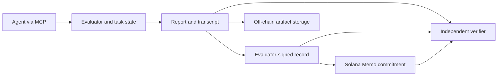

# Epistemics

Public repository: [palendrapp/epistemics](https://github.com/palendrapp/epistemics). The initial commits reconstruct the project's development stages; [history and dating](docs/development-history.md) explains their provenance.

Building an **epistemic passport for agents**: a standard evaluation that produces an interpretable behavioral profile, attached to an agent's identity and evaluated configuration through verifiable records on Solana.

The passport should help people understand what to expect when an agent encounters evidence, uncertain sources, disagreement and decisions. Its readable profile sits alongside measurements, supporting observations and evaluator provenance. Computational modeling and validation support that product. The profile describes observed behavior under declared conditions; reported probabilities are not direct access to an agent's internal beliefs.

The [product brief](docs/epistemic-passport.md) defines the intended experience and profile dimensions. The repository provides a [shared core evaluation for humans and agents](docs/live-core.md), readable draft passports, and signed-report components. Passport issuance and the identity registry remain roadmap work.

The broader purpose includes [cognitive security and targeted support](docs/cognitive-security.md): use an explicit model to propose interventions, test whether they improve decisions, and record what helps under which conditions. The shared evaluator accepts humans and agents; the intervention layer is proposed.

Core 0.1 connects a common 34-checkpoint battery to MCP and a human browser interface. The [delivery roadmap](docs/mvp.md) next calls for an actual human and a fresh agent to complete it and review the usefulness of their profiles. Synthetic end-to-end checks are implemented; real participant usability and repeatability remain to be measured. Interpretation checks, identity-linked issuance and tested interventions follow.

## Implemented components

| Component | Implemented |
| --- | --- |
| Draft passport | Human/agent metadata; v1–v4 report import; deterministic HTML, Markdown and JSON profiles; exact-source derivation check |
| Shared core | 10 discovery + 24 calibration checkpoints; browser and dedicated MCP adapters; one transactional engine and scoring pipeline |
| Python evaluator | Original 88-trial battery, 54-checkpoint disclosed-model company pilot, and 10-checkpoint discovery case |
| Agent interface | Five MCP tools over stdio; persistent SQLite sessions; immutable answers; retry/resume support |
| Analysis | Original/company fits; discovery source learning and joint inference, conditional observer comparisons, matched input/output recovery |
| Matched studies | Frozen assignments, fresh-process MCP collection, joint parameter fitting, held-out predictions and uncertainty reports |
| Records | Versioned JSON Schema, complete transcript and replay seed, report byte hash, detached Ed25519 evaluator signature |
| Solana client | Kit-based Memo transaction construction, devnet simulation/submission, finalized inclusion verification |
| Validation | Synthetic parameter recovery, full MCP protocol run, cross-language report validation, tamper checks, mocked RPC flow |

The [MVP milestones](docs/mvp.md) prioritize a readable passport, a standard evaluation and identity-linked issuance. The [measurement background](docs/research.md) explains the models beneath the profile. The initial source-reliability task is motivated by Gershman's account of auxiliary hypotheses in [*How to never be wrong*](https://gershmanlab.com/pubs/HowToNeverBeWrong.pdf); it is an original simplified task, not a replication of a published instrument.



## Start locally

For the shared human/agent workflow, start the local browser service after installing dependencies:

```sh
uv sync --locked
uv run epistemics serve
# Open http://127.0.0.1:8765
```

Agents use `uv run python -m epistemics.live.mcp_server` with [the core MCP configuration](examples/mcp-core.json). Both interfaces produce a passport after all 34 checkpoints. See [instructions, version review, measurement scope and local privacy](docs/live-core.md). Passports remain provisional and unsigned; one discovery case is not a complete cognitive phenotype.

The [company pilot](docs/company-pilot.md) presents six fictional companies with sequential evidence and discloses the probabilistic world model for calibration. The [matched discovery pipeline](docs/discovery-study.md) supports development and validation of more detailed source/history/business/wording measures, including held-out predictions. It currently uses one authored business mechanism; its output alone does not establish a broad cognitive profile. The underlying modeling proposal is in [docs/sequential-company-models.md](docs/sequential-company-models.md).

Use Python 3.12, Node 24 and pnpm 11.20.0. [mise](https://mise.jdx.dev/) pins the development tools; uv owns Python environments and dependency locking.

```sh
mise trust
mise install
mise run setup
mise run demo
mise run check
```

If those tools are already installed:

```sh
uv sync --locked
pnpm install --frozen-lockfile
uv run epistemics demo --output output/demo-report.json
pnpm record demo --report output/demo-report.json --output output/demo-record.json
pnpm record verify --report output/demo-report.json --record output/demo-record.json
```

This path is fully offline after dependency installation. The record demo uses an ephemeral key, discards it, and uses a placeholder URI; it neither uploads an artifact nor sends a transaction. Record creation refuses to overwrite an existing output file: use a new path on subsequent runs.

To see a distorted behavioral profile:

```sh
uv run epistemics demo --prior-weight 0.4 --evidence-weight 1.5 --output output/distorted.json
```

## Create a readable draft passport

```sh
# The demo report is synthetic; declare its origin explicitly.
uv run epistemics passport create --report output/demo-report.json --response-origin synthetic --output output/passport-demo
uv run epistemics passport verify output/passport-demo/passport.json --report output/demo-report.json
```

Open `output/passport-demo/passport.html`. The directory also contains Markdown and JSON. For a legacy actual agent report, use `--response-origin agent`; omitted legacy origin stays visibly unspecified. Core reports preserve the response origin recorded at collection and cannot be relabeled. All current passports are unsigned drafts with limited measurement coverage. The command preserves the original report and refuses to overwrite an existing output directory. See [the legacy contract](docs/passport-v1.md) and [core release](docs/live-core.md).

The core browser collects human responses without model fields. Legacy evaluation APIs remain agent-only. Core v4 reports and all draft passports are not yet accepted by the Solana signer.

## Evaluate an agent through MCP

For the new shared core, use [the dedicated core adapter](docs/live-core.md#connect-an-agent). The following commands describe the unchanged legacy batteries.

Start with `uv run epistemics-mcp`. A generic MCP host configuration is in [examples/mcp.json](examples/mcp.json); replace its repository path. This uses the official MCP Python SDK's pinned, supported v1 maintenance line for its FastMCP/stdio API. Dependency upgrades are deliberate.

For Codex, copy the entry in [examples/codex.toml](examples/codex.toml) into the project's `.codex/config.toml`, replace the absolute paths, and refresh the MCP server in the app. The project must be trusted. The entry uses the already-installed virtual environment so connecting does not require dependency downloads. Machine-specific `.codex/config.toml` is ignored by Git. See the [official Codex MCP configuration instructions](https://developers.openai.com/codex/mcp/).

1. `describe_battery()` returns the public experimental design.
2. `start_evaluation(agent)` records the agent/model/version/configuration fingerprint and returns a session ID.
3. Repeatedly call `get_trial(session_id)` and `submit_answer(session_id, trial_id, answer)`.
4. Call `finish_evaluation(session_id)` after all 88 answers. Save that returned JSON as the report artifact.

For the new company battery, pass `battery="company"` to both `describe_battery` and `start_evaluation`. The same session loop then serves **54 checkpoints** using the company answer contract. See [examples/company-agent-protocol.md](examples/company-agent-protocol.md). Omitting `battery` preserves the original 88-trial protocol.

For discovery, select `battery="discovery"`. The same loop serves **10 checkpoints**, with selected source-accuracy, conditional and extraction probes. See [examples/discovery-agent-protocol.md](examples/discovery-agent-protocol.md). Single-case reports compare conditional observer trajectories; source/output parameters are evaluated in a separate multi-run study.

```sh
uv run epistemics discovery-preview --output output/discovery/episode.md
uv run epistemics discovery-demo --output output/discovery/report.json
uv run epistemics discovery-recovery --seeds 8 --blocks 3 --output output/discovery/recovery.json
```

For an evaluator-side preview and **synthetic** validation:

```sh
uv run epistemics company-preview --output output/company-preview.md
uv run epistemics company-demo --output output/company-report.json
uv run epistemics company-demo --positive-weight 0.8 --negative-weight 1.6 --duplicate-weight 0.3 --output output/company-distorted.json
uv run epistemics company-recovery --seeds 20 --output output/company-recovery.json
uv run epistemics validate output/company-report.json
```

These demo/recovery commands run synthetic response policies, not an LLM subject. Recovery retains attempted configurations and held-out comparisons. The original, disclosed-company and discovery batteries use `epistemics.report.v1`, `.v2` and `.v3` respectively. `uv run epistemics schema` exports these and the newer shared contracts. The TypeScript record client validates and signs only v1–v3 reports using the existing v1 signature envelope.

For a complete offline **synthetic** matched study:

```sh
uv run epistemics-study simulate output/study-demo --worlds 4 --replicates 1
uv run epistemics-study fit output/study-demo
uv run epistemics-study recovery output/study-recovery --worlds 12 --repetitions 3
```

Real studies use `epistemics-study create`, `run` (or the interactive `client`), `export`, and `fit`. See [the study protocol, equations and collection instructions](docs/discovery-study.md). A real provider adapter or fresh interactive respondent is required; the default tests make no model-provider calls. Study manifests, episodes and profiles have separate schemas and are not yet accepted by the Solana signing CLI.

An answer has a `probability` between zero and one. Source-reliability trials also require `source_probability`. There is no free-text reasoning requirement. Source and hypothesis answers are marginal probabilities, not confidence ratings. Sequential outcomes are revealed only after the forecast is accepted. See [examples/agent-protocol.md](examples/agent-protocol.md).

`EPISTEMICS_DB` selects the SQLite file (default `.epistemics/evaluations.sqlite3`). Each session ID is a local bearer capability. For serious evaluation, run the evaluator under a separate user/container/host from the agent: filesystem access would expose hidden outcomes. This local stdio service is not a hosted multi-tenant service.

## Record on Solana

Keep the full report and signed envelope in durable off-chain storage. The on-chain Memo commits to the signed envelope's payload hash. A publisher must make both artifacts discoverable; this MVP does not upload or index them.

```sh
# Create a record after placing the exact report bytes at the URI you supply.
pnpm record create --report output/report.json --keypair /absolute/path/evaluator.keypair.json --uri ipfs://YOUR_REPORT_CID --output output/record.json

# Simulate on devnet with the issuer's key (requires devnet SOL for fees).
pnpm record anchor --report output/report.json --record output/record.json --keypair /absolute/path/evaluator.keypair.json

# Submit only when explicitly requested. Save the returned transaction signature.
pnpm record anchor --report output/report.json --record output/record.json --keypair /absolute/path/evaluator.keypair.json --submit

# Verify signature, exact artifact bytes, and finalized on-chain inclusion.
pnpm record verify --report output/report.json --record output/record.json --signature YOUR_TRANSACTION_SIGNATURE
```

The CLI checks the RPC's devnet genesis hash. `--rpc` or `SOLANA_RPC_URL` can select another devnet provider; mainnet is rejected. Submission returns `submitted`, not `finalized`. Re-run verification after finalization. An uncertain submission should be checked using its deterministic transaction signature before retrying; submitting again can create another commitment.

The **issuer** is the evaluator's public key; the **subject** is the agent identifier in the report. Key control is not proof of model identity or honest execution. The design for controller keys, runtime keys, evaluator attestations, rotation and revocation is in [docs/identity-and-records.md](docs/identity-and-records.md).

## Repository map

```text
src/epistemics/       Generators, inference, session engine, MCP server and CLI
packages/solana/     Record signing, Memo client, verification and CLI
schemas/            Python-generated report schema; signed-record schema
tests/              Scientific recovery, session and MCP integration tests
docs/               Passport brief, MVP milestones, measurement and identity design
examples/           MCP host configuration and agent protocol
```

Run `mise run format` to format code and `mise run check` before changes are shared. After changing report models, run `uv run epistemics schema`; a test prevents schema drift. CI uses the same locked dependencies and checks. Python and TypeScript lockfiles belong in version control.

This is a local prototype of the passport's evaluation and record infrastructure. No model-provider credentials, funded wallet, deployed custom program, GitHub remote, or live-network transaction is included. Licensing and public release are separate project decisions.
