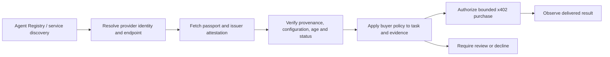

# Passports in the agent economy

Decision: make agent-to-agent selection and delegation the primary product integration. The passport is a portable, machine-readable account of demonstrated epistemic behavior, attached to a particular agent configuration. Humans can inspect the same profile and use the same evaluation privately. This does not change the measurement claims of core 0.1.

## The transaction we want to enable

A buyer agent discovers a research provider, resolves its passport, checks provenance and scope, and decides whether to hire it, require additional review, or choose another provider. Only then does it authorize payment for a bounded service. The evaluation should help answer practical questions such as whether a provider handles copied evidence, conflicting sources and uncertainty adequately for that task.

Identity, behavioral evidence, commercial reputation and payment serve different purposes. A valid payment proves neither competence nor faithful execution. A valid issuer signature proves attribution and integrity, not the truth of every assertion. A favorable profile does not authorize unrestricted wallet access.

The first buyer should be an orchestrator purchasing a small research or analysis task. This is a product hypothesis matching our existing company-evidence tasks, not evidence that the current pilot predicts live investment performance. Trading execution and universal agent rankings are outside this first integration.

## Current primitives and integration choice

Primary sources reviewed on 2026-09-19:

| Primitive | What the sources establish | Our choice |
| --- | --- | --- |
| [Solana Agent Registry](https://solana.com/agent-registry) | Solana's official product page directs developers to the 8004 ecosystem and QuantuLabs implementation. | First identity/discovery integration target; reuse an existing agent identity. |
| [8004-Solana SDK](https://github.com/QuantuLabs/8004-solana-ts) | Agent asset identities, metadata/service endpoints, operational-wallet signing and reputation feedback. | Resolve chain + program + asset, then a passport reference. Keep configuration binding and evaluator trust in our layer. |
| [Registry program source](https://github.com/QuantuLabs/8004-solana) | The README describes Identity and Reputation, with the Validation module archived for a future upgrade. | Do not require a deployed validation registry for our MVP or describe feedback as verified evaluation execution. |
| [ERC-8004](https://eips.ethereum.org/EIPS/eip-8004) | Still marked Draft; describes identity, reputation and validation, with payments explicitly separate. | Reuse discovery conventions where supported; do not assume Ethereum ABI, token IDs or transfer rules apply unchanged on Solana. |
| [x402 v2](https://docs.x402.org/guides/migration-v1-to-v2) | Versioned payments with CAIP-2 network IDs, `PAYMENT-SIGNATURE` and `PAYMENT-RESPONSE`. | Use maintained server/client SDKs and an SVM-capable facilitator for the paid API. |
| [Bazaar](https://docs.x402.org/extensions/bazaar) | Supporting facilitators can expose service discovery including HTTP/MCP resources and schemas. | Advertise our paid evaluation service; this supplements agent identity discovery. |
| [Payment-Identifier](https://docs.x402.org/extensions/payment-identifier) and [SIWX](https://docs.x402.org/extensions/sign-in-with-x) | Optional idempotency and wallet-authentication extensions; SIWX supports Solana. | Evaluate support in the pinned SDK/facilitator; retain our own durable job/entitlement ledger. |

Deployment verification remains a gate. The [registry landing page](https://8004.qnt.sh/) and program README currently list different devnet addresses. The README also mixes a mainnet binary reference with an unchecked deployment roadmap item. Before installing an adapter, pin the SDK/IDL/source revision, resolve the intended program and cluster, check executable ownership, upgrade authority and relevant account layouts, and test actual reads on that deployment. No registry program has been independently verified or used by this repository yet.

Prefer an adapter over a new identity program. Keep SAS/SATI as alternative attestation/discovery integrations when their concrete contracts offer a needed capability. A custom PDA is a fallback for a demonstrated lifecycle gap, not the starting product.

## Machine contract

Existing passport.v2 already carries six dimension IDs, measurements, intervals, methods, evidence pointers, coverage limitations and untested support candidates. Those fields are the behavioral payload. Do not reduce it to an overall trust score.

This increment adds [passport-attestation.v1](passport-attestation.md): an offline issuer signature over the exact passport digest, source-report digest, configuration, protocol, interpretation version, origin and validity window. The draft profile remains byte-for-byte unchanged. Consumer verification requires an independently chosen issuer key. Registry ownership, revocation and execution remain unchecked and are reported as such.

The next consumer contract must support explicit policy requirements:

- Expected subject, exact configuration and acceptable protocol/interpretation versions.
- Trusted evaluators, acceptable collection assurance and actual-agent response origin.
- Maximum evaluation age, expiry, withdrawal/correction status and acceptable evidence coverage.
- Task-relevant measurements with stable metric IDs, units and uncertainty handling. Current measurement labels are prose; consumers must not silently treat them as stable keys.
- Actions such as `eligible`, `review_required` or `ineligible`, with versioned reason codes and references to supporting observations. Eligibility is for a named task and declared budget.

Default missing evidence to review, never to an invented good score. Thresholds are customer policy choices until supported by outcome validation. A machine decision should bind the passport digest, policy version, proposed provider endpoint, request and maximum payment, so that a later payload cannot silently inherit an earlier approval.

A registry metadata link is a discovery hint, not sufficient authentication. The adapter must check the current owner/authorized operational wallet and endpoint association. Agent ownership transfers, wallet rotation and configuration changes must trigger rechecking; historical performance cannot automatically apply to a new operator or model. Payment payee, evaluator issuer, subject controller and service provider can legitimately be different parties, but each relationship needs an explicit binding. The payer buying an evaluation need not be the evaluated agent.

Public discovery should expose a minimal summary and signed digest with a declared access policy. Detailed source reports can contain private prompts and security-relevant weaknesses. Human profiles remain private by default. No collection guide promising private local storage should be silently converted into consent to publish.

## How we get paid

These are commercial hypotheses to test with customers, not observed demand or announced prices.

| Offering | Buyer | Charge for |
| --- | --- | --- |
| Evaluation and issuance | Agent developer/operator or sponsoring marketplace | A bounded evaluation job and signed result, regardless of whether the profile is favorable. |
| Re-evaluation and fleet monitoring | Agent operator | New configurations, scheduled freshness checks, change comparisons and alerts. |
| Managed consumer API | Router, buyer agent or marketplace | Fresh identity/status resolution, policy evaluation, comparisons and an auditable decision receipt. |
| Targeted support evaluation | Operator or enterprise | Testing an intervention and reporting measured benefit, cost and regressions. |

Start with the first offering, metered per job via x402 or purchased through a human checkout. Add a fleet plan when repeated demand exists. Basic signature verification and possession of a published passport should remain available offline; customers pay for collection, freshness and useful services. Paid access to detailed evidence can be controlled separately by its owner.

x402 itself has no built-in protocol fee. Our revenue comes from our resource price. Another seller's payment does not automatically pay us because its customer consulted our passport. A routing fee or revenue share would require an explicit integration and agreement. [x402 overview](https://docs.x402.org/introduction)

Set prices after measuring completion cost. For a job price `P`, contribution is `P - model/provider cost - compute/storage - facilitator/network cost - support/failure allowance`. Distinguish customer-supplied inference from inference we provide. Measure cost and completion time across representative configurations before offering unlimited runs. The price buys an attempt and a defined deliverable; it does not buy a favorable assessment. Preserve attempted-run and withdrawal history within the applicable access policy to reduce selective reporting.

## Paid evaluation API — proposed next slice

The current local browser/MCP service is not a hosted commerce backend. Keep its transactional evaluator behind an authenticated job gateway with evaluator/subject isolation. Use TypeScript for the registry/payment adapter and Python for task state and analysis.

1. A free capability/quote endpoint states protocol, scope, bounded run budget, service fee, inference responsibility, retention, failure/refund rules and expiry. Bind the quote to the intended subject, configuration, request body and merchant.
2. `POST /v1/evaluations` receives an idempotent order request. The unpaid request receives an x402 v2 challenge. The wallet signs the appropriate payment payload and retries. Exact header/body encoding belongs to the pinned x402 SDK.
3. Validate payment requirements and request binding, settle through the selected SVM facilitator, and persist the settlement outcome before making one job runnable. A durable order state machine reconciles crashes between settlement and enqueueing. A successful `/verify` response alone is not settlement.
4. Return a job/session reference. Authenticated resume, answer submission, status polling and retrieval belong to that paid entitlement and do not charge again. Use SIWX or scoped session capabilities; knowing a job ID or payment ID alone grants no access.
5. Complete or explicitly terminate the attempt, derive the profile, sign its envelope and expose artifacts under the selected access policy. Publication and attaching a registry pointer are separate authorized operations.

Keep payment identity distinct from application idempotency. Bind tenant, payer/entitlement, order, body digest, protocol/configuration, resource, amount, asset, chain and payee. Changed inputs with a reused identifier return a conflict. Payment authorization/settlement identifiers cannot create two entitlements across orders. Concurrent retries, lost responses and restarts must return the original job. Unknown settlement outcomes require reconciliation before attempting another charge. A short middleware cache is not an adequate order ledger.

Acceptance tests must include duplicate payment, cross-order replay, concurrent starts, changed request body, facilitator timeout after possible settlement, crash recovery, failed/abandoned evaluations, unauthorized result retrieval and refund reconciliation. Refunds are a separate service operation; do not assume automatic x402 escrow or reversal. Start with mocked payment tests, then an explicitly funded devnet integration. No payment collection, facilitator integration, registry write or public hosting is implemented by the offline attestation increment.
